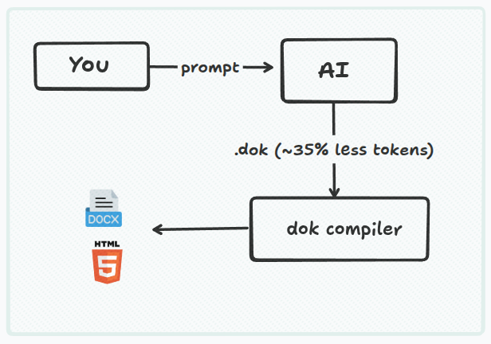

# dok

**Document markup language for AI and humans, compiles to DOCX and HTML.**

Write structure. Let AI fill it. Compile to anything.

```bash
pip install dok
```

> **Zero dependencies.** Pure Python stdlib. `pip install dok` installs exactly one thing.

---

## The problem with AI document generation today

Ask an AI to generate a Word document and one of three things happens:

- It writes python-docx code that **silently breaks** on anything non-trivial — wrong XML element ordering, missing bidi tags, corrupt output with no error message
- It writes Markdown that **loses all formatting** the moment it touches a real document converter
- It hallucinates OOXML directly and produces **a file Word refuses to open**

The root cause is not the AI. It is that there is no clean, compact format that maps directly to a rich document. So AI uses whatever is closest and gets it wrong.

**Dok fixes that.**

---

## How it works




The AI never touches OOXML. It never manages RTL bidi ordering. It never thinks about twips, half-points, or content type manifests. It outputs clean structure. The compiler handles everything below.

---

## Show me

A complete invoice. AI generates this:

```
doc(font: Calibri, size: 11) {
  page(margin: normal) {

    banner(fill: #1F3864, accent: gold, color: white) {
      center { bold(size: 16) { "INVOICE" } }
    }

    table(border: true, striped: true) {
      tr { th { "Item" }       th { "Qty" } th { "Price" }  }
      tr { td { "Consulting" } td { "3" }   td { "$900" }   }
      tr { td { "Design" }     td { "1" }   td { "$400" }   }
    }

    right { bold(size: 14) { "Total: $1,300" } }
  }
}
```

Compile it to any format:

```bash
python -m dok invoice.dok invoice.docx    # Word document
python -m dok invoice.dok invoice.html    # Web / email
```

Same source. Every format. No reformatting.

---

## Why AI generates dok reliably

**The grammar fits in a system prompt.** The entire language is five node types and one rule. An AI learns it in ~200 tokens and produces valid output consistently. Compare that to teaching a model the full OOXML specification.

**One way to express everything.** There is no ambiguity. No five ways to write the same structure. Fewer choices mean fewer hallucinations.

**Errors are self-correcting.** When AI makes a mistake, the compiler returns a structured error with the source line and an exact fix:

```
ValidationError at line 4: 'bold' cannot be inside 'page'
  Hint: bold is a style node — wrap content in a paragraph first.
  p { bold { "your text" } }
```

The AI reads that, corrects it, retries. No human involved. Convergence in one or two iterations.

---

## RTL and Arabic — first class, not an afterthought

Arabic and Hebrew rendering in OOXML requires three XML elements in strict order. Get the order wrong and the document silently renders left-aligned. There is no error. Word just opens it broken.

In dok, one wrapper node handles everything:

```
rtl {
  h1 { "التقرير السنوي" }
  p  { "نما الإيراد بنسبة " bold { "42%" } " هذا العام." }
}
```

Mixed direction works correctly too:

```
rtl {
  p { "نص عربي " ltr { bold { "English term" } } " نص عربي" }
}
```

No manual bidi tags. No XML ordering bugs. No post-processing. It compiles correctly every time.

---

## What dok replaces

| Tool | What it does | Price | Dok equivalent |
|------|-------------|-------|----------------|
| DocRaptor | HTML → PDF API | $15–200/month | `dok.to_pdf()` |
| Carbone | Template → DOCX/PDF | $49–299/month | `dok.to_docx()` |
| PDFMonkey | Template → PDF | $19–149/month | `dok.to_pdf()` |
| Docmosis | Enterprise doc generation | $150+/month | All of the above |

Open source. No API key. No per-document pricing. Runs locally or on your own server.

---

## Five-minute integration with any AI

```python
import dok
import anthropic

client = anthropic.Anthropic()

SYSTEM_PROMPT = """
You generate documents in dok syntax. Output only valid dok. No explanation, no markdown fences.

Dok has five layers — each node belongs to exactly one:
  doc    → document defaults (font, size, spacing)
  page   → physical space (margin, paper, cols)
  layout → arrangement (center, right, rtl, ltr, indent, row, cols)
  style  → appearance (bold, italic, underline, color, size, font, highlight)
  content → atoms (h1-h4, p, code, ul/ol/li, table/tr/th/td, box, banner, callout, badge, line, img, link)

One syntax rule: name(props) { children }
Text is always quoted: "like this"
Multiline text uses triple quotes: \"\"\"like this\"\"\"
"""

def generate_document(prompt: str, output_path: str):
    response = client.messages.create(
        model="claude-sonnet-4-5",
        max_tokens=2048,
        system=SYSTEM_PROMPT,
        messages=[{"role": "user", "content": prompt}]
    )

    source = response.content[0].text
    node = dok.parse(source)

    if output_path.endswith(".docx"):
        dok.to_docx(node, output_path)
    elif output_path.endswith(".html"):
        dok.to_html(node, output_path)

generate_document(
    "Invoice for Alice. Consulting 3 days at $300/day. Design 1 day at $400. Show total.",
    "invoice.docx"
)
```

---

## Installation

```bash
pip install dok
```

---

## Quick start

**Command line:**

```bash
python -m dok report.dok report.docx      # compile to Word
python -m dok report.dok report.html      # compile to HTML
python -m dok --check report.dok          # validate only
python -m dok --tree report.dok           # print node tree
```

**Python:**

```python
import dok

node = dok.parse('doc { h1 { "Hello World" } }')
dok.to_docx(node, "hello.docx")
dok.to_html(node, "hello.html")
```

---

## The core idea

A document is a stack of contexts.

```
doc(font: Calibri, size: 11) {     // sets document defaults
  page(margin: normal) {           // sets physical space
    center {                       // sets alignment
      bold(color: navy) {          // sets run style
        h1 { "Quarterly Report" }  // content atom
      }
    }
  }
}
```

Each layer adds one thing to the context. Content at the bottom inherits everything above it. No cascade. No specificity. No global state. Just a tree where context flows inward.

Every feature is a node at one of five layers:

```
doc     →  document defaults    (font, size, spacing)
page    →  physical space       (margin, paper, cols)
layout  →  arrangement          (center, right, rtl, row, cols, indent)
style   →  appearance           (bold, italic, color, size, font)
content →  atoms                (h1-h4, p, code, box, line, table, ul/ol, img, link)
```

---

## What dok deliberately does not do

Dok has no variables. No loops. No conditionals. No expressions.

This is not a limitation to work around — it is the design.

Loops and conditionals live in your programming language, which already does them better than any template engine. Dok's job is to describe what the document looks like. Your language's job is to decide what goes into it.

**Dok handles:** structure, appearance, shapes, layout, direction, composition, functions.

**Your language handles:** which sections to include, how many items in a list, what color a status badge should be, whether to show a warning block.

The boundary is clean. The compiler is simple. The output is predictable.

---

## Feature overview

| Category | Features |
|----------|----------|
| **Output** | `.docx` (Word), `.html` (standalone) |
| **Text** | Headings (h1–h4), paragraphs, block quotes, code blocks |
| **Strings** | Single-line `"..."`, multiline `"""..."""` with auto-dedent |
| **Styles** | Bold, italic, underline, strikethrough, superscript, subscript, color, font, size, highlight |
| **Layout** | Center, right, justify, RTL/LTR, indent, columns, float |
| **Columns** | `page(cols: 2)` for newspaper-style flow, `cols(ratio: 2:1)` for side-by-side layout |
| **Containers** | Box (width/height), callout, banner, badge |
| **Lists** | Bullet (ul/li), numbered (ol/li) |
| **Tables** | Headers, borders, striped rows, colspan |
| **Images** | PNG/JPEG embedded in DOCX, inline in HTML |
| **Links** | Clickable hyperlinks, styled content inside links |
| **Shapes** | Circle, diamond, chevron with arrow connectors |
| **Page control** | Page breaks, page numbers, headers, footers, spacers |
| **Spacing** | Document-wide presets, per-paragraph override, line-height control |
| **Code** | Syntax-preserving blocks, monospace, background, border |
| **Functions** | Reusable components with parameters and `children` |
| **Imports** | Split documents into modules with `import "file.dok"` |
| **Direction** | Full RTL for Arabic/Hebrew with `rtl { }` |
| **Validation** | Prop types, structure rules, all errors with source location and fix hints |

---

## Syntax

One rule for every node in the language:

```
name(props) { children }    // node with props and children
name { children }           // node with no props
name(props)                 // self-closing node
"text"                      // bare text node (single line)
"""text"""                  // triple-quoted text (multiline, auto-dedent)
->                          // arrow connector (inside row only)
---                         // page break
// comment                  // line comment, stripped before parsing
```

Props are always `key: value` pairs or bare flags:

```
fill: navy          // named color
fill: #4472C4       // hex color
size: 14            // number
src: "image.png"    // string value
rounded             // bare flag (boolean true)
```

**Multiline strings** use triple quotes with automatic leading-indentation removal:

```
p {
  """
  This paragraph spans multiple lines.
  Leading indentation is automatically stripped.
  The output is clean flowing text.
  """
}

code {
  """
  def fibonacci(n):
      if n <= 1:
          return n
      return fibonacci(n-1) + fibonacci(n-2)
  """
}
```

---

## The five layers

### Layer 1 — doc

Sets document-wide defaults. Everything inside inherits these unless overridden.

```
doc(font: Calibri, size: 11) {
  // all content here
}
```

| Prop | Values | Default |
|------|--------|---------|
| `font` | any system font name | `Calibri` |
| `size` | number in points | `11` |
| `spacing` | `compact` `tight` `normal` `relaxed` | `normal` |

Spacing presets control paragraph spacing and line height across the whole document:

- `compact` — zero paragraph gap, single line spacing
- `tight` — small paragraph gap, single line spacing
- `normal` — standard Word spacing (8pt after, 1.15× line height)
- `relaxed` — generous spacing (10pt after, 1.3× line height)

`doc` is optional. If omitted, all defaults apply.

---

### Layer 2 — page

Sets the physical page. Multiple `page` nodes create multiple sections with different layouts.

```
doc {
  page(margin: normal) {
    // standard content
  }

  page(margin: wide, cols: 2) {
    // two-column section
  }
}
```

| Prop | Values | Default |
|------|--------|---------|
| `margin` | `normal` `narrow` `wide` `none` | `normal` |
| `paper` | `a4` `letter` `a3` | `a4` |
| `cols` | `1` `2` `3` | `1` |

`cols: 2` creates newspaper-style columns: text flows down the left column then continues at the top of the right. This is native Word section columns — ideal for research papers, newsletters, and academic documents.

```
// Research paper: full-width title, two-column body
doc(font: "Times New Roman", size: 10, spacing: tight) {
  page(margin: normal, cols: 1) {
    center { bold(size: 16) { "Paper Title" } }
    // abstract...
  }
  page(margin: normal, cols: 2) {
    h2 { "Introduction" }
    p { "Body text flows automatically into the second column." }
  }
}
```

`page` is optional. If omitted, `margin: normal` and `paper: a4` apply.

---

### Layer 3 — layout

Arrangement nodes affect how their children are placed on the page.

```
center { h1 { "Title" } }
right  { p  { "Right-aligned" } }
rtl    { p  { "نص عربي" } }

indent(level: 2) {
  p { "Indented two levels." }
}

row {
  box(fill: blue, color: white)   { "Step 1" }  ->
  box(fill: orange, color: white) { "Step 2" }  ->
  box(fill: green, color: white)  { "Step 3" }
}

cols(ratio: 2:1) {
  col { p { "Wider column." } }
  col { p { "Narrower column." } }
}
```

| Node | What it does |
|------|-------------|
| `center` | Centers children horizontally |
| `right` | Right-aligns children |
| `left` | Left-aligns children (default, rarely needed) |
| `justify` | Justifies text in children |
| `rtl` | Sets right-to-left direction for all children |
| `ltr` | Sets left-to-right direction (override inside rtl) |
| `indent(level: N)` | Indents N levels (each level = 0.5 inch) |
| `row { A -> B }` | Places children side by side with optional arrow connectors |
| `cols { col col }` | Side-by-side column layout |
| `float(side: right)` | Floats content right, text wraps around it |

---

### Layer 4 — style

Style wrappers modify how text renders. They nest freely.

```
p {
  "Normal text, then "
  bold { "bold" }
  ", then "
  italic(color: navy) { "italic navy" }
  "."
}
```

| Node | Effect |
|------|--------|
| `bold` | Bold text |
| `italic` | Italic text |
| `underline` | Underlined text |
| `strike` | Strikethrough |
| `sup` | Superscript |
| `sub` | Subscript |
| `color(value: red)` | Text color (named or hex) |
| `size(value: 14)` | Font size in points |
| `font(value: Georgia)` | Font family |
| `highlight(value: yellow)` | Highlight color |
| `span(bold, color: red, size: 14)` | Multiple styles at once |

Style nodes can carry inline props — these are equivalent:

```
bold { color(value: red) { "hello" } }
bold(color: red) { "hello" }
```

---

### Layer 5 — content

Content nodes are the atoms. They produce visible output.

**Text blocks:**

| Node | Description |
|------|-------------|
| `h1` to `h4` | Headings |
| `p` | Paragraph |
| `quote` | Block quote |
| `code` | Code block (monospace, multiline via `"""`) |
| `"text"` | Bare text node |
| `---` | Page break |

Per-element spacing and line-height control:

```
p(spacing: compact) { "No space after this paragraph." }
p(spacing: relaxed) { "Extra space after this one." }
p(line-height: 15)  { "1.5× line spacing." }
p(line-height: 20)  { "Double-spaced." }
```

`line-height` is in tenths: `10` = single, `15` = 1.5×, `20` = double.

**Code blocks:**

```
code { "console.log('hello')" }

code {
  """
  def fibonacci(n):
      if n <= 1:
          return n
      return fibonacci(n-1) + fibonacci(n-2)
  """
}
```

- **DOCX**: Courier New 10pt, light gray background (#F5F5F5), thin border
- **HTML**: Monospace font, gray background, rounded border, preserved whitespace

**Lists:**

```
ul {
  li { "First bullet" }
  li { "Second with " bold { "inline formatting" } }
}

ol {
  li { "Step one" }
  li { "Step two" }
}
```

Produces native Word bullet and numbered lists with correct indentation.

**Tables:**

```
table(border: true, striped: true) {
  tr {
    th { "Name" }
    th { "Score" }
  }
  tr {
    td { "Alice" }
    td { bold(color: green) { "95" } }
  }
}
```

| Prop | Values | Default |
|------|--------|---------|
| `border` | boolean | `false` |
| `striped` | boolean | `false` |

`th` cells are bold with a shaded background. `td(colspan: 2)` spans columns.

**Images:**

```
img(src: "photo.png", width: 4)
img(src: "logo.jpg", width: 2, height: 1)
```

| Prop | Description |
|------|-------------|
| `src` | File path (required) |
| `width` | Width in inches |
| `height` | Height in inches (auto from aspect ratio if omitted) |
| `alt` | Alt text |

PNG and JPEG supported. Embedded in the DOCX file.

**Hyperlinks:**

```
p {
  "Visit "
  link(href: "https://example.com") { "our website" }
  " for more info."
}

// Styled content inside links
link(href: "mailto:contact@example.com") { bold { "Email us" } }

// Multiple links inline
p {
  link(href: "https://github.com") { "GitHub" }
  " | "
  link(href: "https://example.com") { "Website" }
}
```

Links render as blue (#0563C1) underlined text in both DOCX and HTML. In DOCX they are native Word hyperlinks stored in the relationship table.

**Visual elements:**

| Node | Description |
|------|-------------|
| `box` | Bordered/shaded content block |
| `callout` | Side-bordered note block |
| `banner` | Full-width colored block |
| `badge` | Small inline label |
| `line` | Horizontal divider |

```
box(fill: #E8F4FD, stroke: #2196F3, rounded: true) {
  bold { "Info" }
  p { "Content inside the box." }
}

callout(fill: #FFF3CD, stroke: #FFC107, tail: top-left) {
  bold { "Warning:" }
  " Check your input data."
}

banner(fill: #1F3864, accent: gold, color: white) {
  center { bold(size: 16) { "Company Name" } }
}

p { "Status: " badge(fill: green, color: white) { "ACTIVE" } }

line(stroke: gray, dashed: true)
```

**Shape props:**

| Prop | Values | Description |
|------|--------|-------------|
| `fill` | color | Background color |
| `stroke` | color | Border color |
| `color` | color | Text color inside |
| `rounded` | flag | Rounded corners (box only) |
| `shadow` | flag | Drop shadow |
| `accent` | color | Left-edge accent bar (banner only) |
| `width` | integer | Box width as % of page (1–100), default = full |
| `height` | integer | Minimum height in points, default = auto |
| `tail` | `top-left` `top-right` `bottom-left` `bottom-right` | Callout pointer |
| `dashed` | flag | Dashed line |
| `thick` | flag | Thick line |

```
box(fill: #E8F4FD, width: 50)   { p { "Half-width box." } }
box(fill: #FFF2CC, height: 120) { p { "At least 120pt tall." } }
```

**Page numbers:**

```
footer {
  center {
    p { "Page " page-number }
  }
}
```

`page-number` inserts a live Word field that updates automatically.

**Headers and footers:**

```
doc {
  header {
    right { italic(color: gray, size: 9) { "Document Title" } }
  }

  footer {
    center {
      p { color(value: gray, size: 9) { "Page " } page-number }
    }
  }

  page { /* content */ }
}
```

**Spacer:**

```
space(size: 24)    // 24pt vertical space
```

**Color values:**

Named: `red orange yellow green blue navy purple gray black white gold silver`
Light variants: `lightblue lightgreen lightyellow lightgray lightpink`
Hex: `#4472C4` `#1F3864` `#FF0000` `#ABC`
Transparent: `none`

---

## Functions and reuse

Define reusable components with `def`:

```
def alert-box(message) {
  box(fill: #FFF3CD, stroke: #FFC107, rounded: true) {
    bold { "Warning: " }
    message
  }
}

def info-row(label, value) {
  p {
    bold(color: gray) { label }
    value
  }
}

alert-box(message: "Check your data before submitting.")
info-row(label: "Name: ", value: "Alice Johnson")
```

Use the `children` keyword for composable wrappers:

```
def card(title) {
  box(fill: #F5F5F5, rounded: true) {
    bold(size: 14) { title }
    children
  }
}

card(title: "Summary") {
  p { "This content goes where 'children' is." }
  p { "Multiple children work too." }
}
```

---

## Imports

Split large documents into reusable modules:

```
// components.dok
def company-header(title) {
  banner(fill: #1F3864, accent: gold, color: white) {
    center { bold(size: 16) { title } }
  }
}

def signature-block(name) {
  center {
    line
    color(value: gray) { name }
  }
}
```

```
// report.dok
import "components.dok"

doc {
  page {
    company-header(title: "Annual Report")
    h1 { "Introduction" }
    signature-block(name: "CEO")
  }
}
```

Imports resolve relative to the importing file. Circular imports are detected and rejected.

---

## Builder API (Python)

For dynamic content — loops, conditionals, data-driven documents. Your language handles the logic. Dok handles the shape.

Every builder function returns a `Node` — immutable, composable, no side effects.

```python
import dok

doc = dok.doc(
    dok.page(
        dok.banner("Acme Corp", fill="#1F3864", accent="gold", color="white"),
        dok.h1("Report"),
        dok.p("Revenue grew by ", dok.bold("42%", color="green"), "."),
        margin="normal",
    )
)

dok.to_docx(doc, "report.docx")
dok.to_html(doc, "report.html")
```

**All builder functions:**

```python
# Document structure
dok.doc(*children, font=..., size=..., spacing=...)
dok.page(*children, margin=..., paper=..., cols=...)

# Layout
dok.center(*children)
dok.right(*children)
dok.justify(*children)
dok.rtl(*children)
dok.ltr(*children)
dok.indent(*children, level=1)
dok.row(*children)
dok.cols(*children, ratio="1:1")
dok.col(*children)
dok.float_right(*children)
dok.float_left(*children)

# Style
dok.bold(*children, color=..., size=..., font=...)
dok.italic(*children, ...)
dok.underline(*children, ...)
dok.strike(*children, ...)
dok.sup(*children)
dok.sub(*children)
dok.color("red", *children)
dok.size(14, *children)
dok.font("Georgia", *children)
dok.highlight("yellow", *children)
dok.span(*children, bold=True, color=..., size=...)

# Text blocks
dok.h1("Title", ...)    # also h2, h3, h4
dok.p(*children, ...)
dok.quote(*children)
dok.code("source code")

# Lists
dok.ul(dok.li("item"), dok.li("item"))
dok.ol(dok.li("first"), dok.li("second"), start=1)
dok.li(*children)

# Tables
dok.table(
    dok.tr(dok.th("Header"), dok.th("Header")),
    dok.tr(dok.td("Cell"),   dok.td("Cell")),
    border=True, striped=True,
)

# Visual elements
dok.box(*children, fill=..., stroke=..., rounded=True)
dok.callout(*children, fill=..., stroke=..., tail="top-left")
dok.banner(*children, fill=..., accent=..., color=...)
dok.badge("label", fill=..., color=...)
dok.line(stroke=..., dashed=True)

# Inline
dok.img("photo.png", width=4)
dok.link("https://example.com", "click here")
dok.page_number()

# Meta
dok.header(*children)
dok.footer(*children)
dok.space(size=12)
dok.page_break()
dok.arrow(label=None)
```

**Dynamic content:**

```python
# Loops
items = [dok.li(item.name) for item in data]
doc = dok.doc(dok.ul(*items))

# Conditionals — None children are silently dropped
doc = dok.doc(
    dok.page(
        dok.callout("CONFIDENTIAL", fill="red", color="white") if classified else None,
        dok.h1(report.title),
        *[dok.p(section.text) for section in report.sections],
    )
)
```

**Output:**

```python
dok.to_docx(node, "report.docx")
dok.to_html(node, "report.html")

data = dok.to_bytes(node)             # bytes for HTTP / S3

node = dok.parse(source_string)
node = dok.parse(source_string, base_dir=Path("./templates"))
```

---

## Compilation pipeline

```
source → lex → parse → resolve_imports → resolve_functions → validate → convert → write
```

1. **Lexer** — tokenizes the source string
2. **Parser** — builds an AST of Node trees
3. **Import resolver** — reads imported files, injects their nodes
4. **Function resolver** — expands function calls by substituting parameters
5. **Validator** — checks structure rules, prop types, printable constraints
6. **Converter** — walks the AST with context inheritance, produces a DocxModel
7. **Writer** — serializes the DocxModel to OOXML inside a ZIP archive

All errors carry source location (line, column) and human-readable hints.

---

## Error handling

Every error includes source location and an exact fix:

```
ParseError at line 5, col 12: Expected '}' to close block
  Hint: Every '{' needs a matching '}'.

ValidationError at line 8, col 3: 'li' must be inside 'ul' or 'ol'
  Hint: ul { li { "item" } }

ValidationError at line 12, col 5: Invalid color 'notacolor' for 'bold.color'
  Hint: Use a named color (red, navy, gold, ...) or hex (#FF0000, #ABC).

ResolveError at line 3: Missing parameter 'name' in call to 'greeting'
  Hint: Usage: greeting(name: ...)
```

The validator collects all errors in a single pass — you see everything wrong at once, not one error at a time.

---

## Complete example

```
import "components.dok"

def metric(label, value, trend_color) {
  box(fill: #F8F9FA, rounded: true) {
    p { color(value: gray) { label } }
    bold(size: 20, color: trend_color) { value }
  }
}

doc(font: Calibri, size: 11) {

  header {
    right { italic(color: gray, size: 9) { "Q4 2024 Report" } }
  }

  footer {
    center { p { color(value: gray, size: 9) { "Page " } page-number } }
  }

  page(margin: normal) {

    banner(fill: #1F3864, accent: gold, color: white) {
      center { bold(size: 16) { "Acme Corporation" } }
    }

    center {
      h1 { "Q4 2024 Financial Report" }
      italic(color: gray) { "For internal distribution only" }
    }

    row {
      metric(label: "Revenue",   value: "$4.2M", trend_color: green)
      metric(label: "Customers", value: "1,840", trend_color: green)
      metric(label: "Churn",     value: "2.1%",  trend_color: red)
    }

    h2 { "Regional Breakdown" }

    table(border: true, striped: true) {
      tr { th { "Region" }   th { "Revenue" } th { "Growth" }                      }
      tr { td { "EMEA" }     td { "$1.8M" }   td { bold(color: green)  { "+38%" } } }
      tr { td { "Americas" } td { "$1.5M" }   td { bold(color: green)  { "+22%" } } }
      tr { td { "APAC" }     td { "$0.9M" }   td { bold(color: orange) { "+8%"  } } }
    }

    space(size: 12)

    callout(fill: #FFF2CC, stroke: #FFC000, tail: bottom-left) {
      bold { "Note:" }
      p { "These figures are preliminary and subject to audit." }
    }

    h2 { "Key Highlights" }

    ul {
      li { "Enterprise contracts in Germany and UK drove EMEA growth" }
      li { "Customer acquisition cost decreased by " bold { "15%" } }
      li { "New product line launched in Q3 reaching " bold { "$400K" } " revenue" }
    }

    space(size: 24)

    cols(ratio: 1:1:1) {
      col { center { line  color(value: gray) { "CEO" } } }
      col { center { line  color(value: gray) { "CFO" } } }
      col { center { line  color(value: gray) { "Board Secretary" } } }
    }

  }
}
```

---

## File extension

`.dok` — UTF-8 text. Version-control friendly. Diffs cleanly. Readable by non-developers.

For purely dynamic documents, no `.dok` file is needed — build the node tree with the builder API and pass it directly to the compiler.

---

## License

MIT